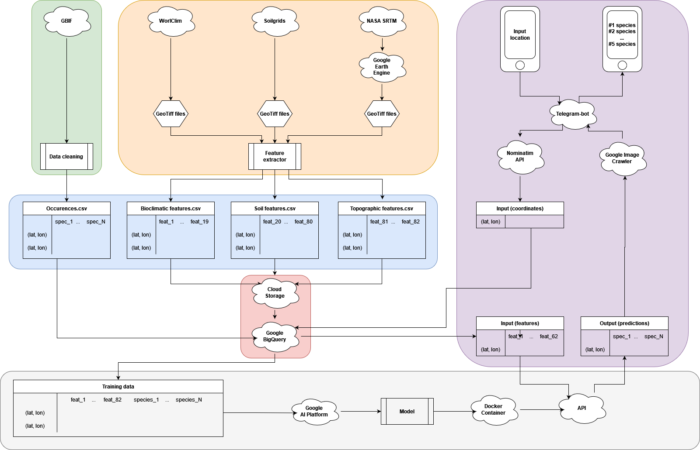

# Biodiversipy

## Overview

- a [Telegram-bot]() (until July11, 2022) taking any location in Germany as input and returning a prediction for the 5 plant species most likely present at that location.
- a student project by @[TmtStss](https://github.com/TmtStss), @[MikkelValdemar](https://github.com/TmtStss/biodiversipy/commits?author=MikkelValdemar), @[massierc](https://github.com/massierc), and @[ElCheckler](https://github.com/ElCheckler) as part of [Le Wagon Full-Time Data Science Bootcamp in Berlin](https://www.lewagon.com/berlin/data-science-course/full-time) (batch #871, April-June 2022).
- Two GitHub repositories
  - [/TmtStss/biodiversipy](https://github.com/TmtStss/biodiversipy): source code (Python) and notebooks for data collection and model training.
  - [/massierc/biodiversipy-bot](https://github.com/massierc/biodiversipy-bot): source code for the Telegram-bot

- A simple showcase for the integration of:
  - Data Science
  - Remote Sensing
  - Citizen Science
  - Web Development

## Under the Hood

## Data

See the following for the data sources details, licenses and disclaimers:

- **Plant species occurences** from the [Global Biodiversity Information Facility (GBIF)](https://www.gbif.org/), an international network and data infrastructure aimed at providing anyone, anywhere, open access to data about all types of life on Earth. Many Citizen Science initiatives lie at the source of GBIF datasets.
- **Soil data** from [Soilgrids](https://soilgrids.org/), a system for digital soil mapping based on a global compilation of soil profile data and environmental layers.
- **Bioclimatic data** from [WorldClim](https://worldclim.org/), a database of high spatial resolution global weather and climate data.
- **Topographic data** from the [NASA SRTM Digital Elevation 30m dataset](https://lpdaac.usgs.gov/products/srtmgl1v003/) accessed via [Google Earth Engine](https://developers.google.com/earth-engine/datasets/catalog/USGS_SRTMGL1_003)

## Biodiversipy Disclaimer

This project and Telegram-bot interface are solely meant for educational and demonstration purposes. The authors cannot be held responsible for the accuracy of the plant species predictions.

This project is an example user application of the broader (and very active) research field of predicting plant (or animal) species distribution maps.

This project was inspired by a [web-application](https://identify.plantnet.org/prediction) using the [AI-GeoSpecies](https://cos4cloud-eosc.eu/services/ai-geospecies/) service developed by the Pl@ntNet team in the framework of the [European Research Cloud](https://cos4cloud-eosc.eu/) based on artificial intelligence algorithms.
